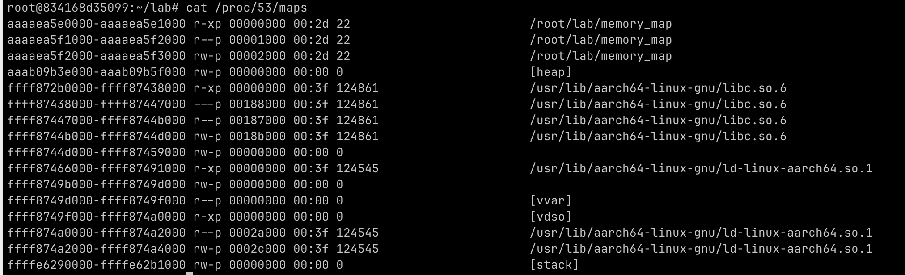

## Context
- **Tactic:** Runtime Memory Observation
- **Technique:** Memory Map Extraction
- **Procedure:**
	- Map process memory layout via `/proc/[pid]/maps` inspection  
	- Break down address ranges, permission flags, and file associations  
	- Trace segment roles and transitions — heap growth, stack behavior, etc.  
	- Assess writable/executable regions for attack surfaces or mitigations  
	- Check ASLR randomness and dynamic library load locations

## Core Idea

**Figure 1.** `/proc/[pid]/maps` output of a sample process

The `/proc/[pid]/maps` file shows the detailed memory layout of a running Linux process, including address ranges, permissions, file offsets, and mappings.


## Code / Experiment

To reproduce this analysis:

```bash
gcc memory_map.c -o memory_map
./memory_map &
cat /proc/$(pidof memory_map)/maps
```

Or inside Docker:

```bash
docker exec -it <container_id> bash
cat /proc/<pid>/maps
```

## Note

### Memory Mapping Entry Format
```
Address Range             Perm   Offset    Device   Inode     File Path         
------------------------- ----- ---------  -------  -------  -----------------
7f9c4e000000-7f9c4e021000 r-xp  00000000   fd:01    123456    /lib/libc.so.6      
```
- **Address Range**: Start and end of the virtual address
- **Perm**: Permissions (`r`=read, `w`=write, `x`=execute, `p`=private)
- **Offset**: File offset (used with mmap)
- **Device**: Device major:minor ID
- **Inode**: Unique file ID in filesystem
- **Path**: Mapped file or region (e.g., library or [heap], [stack])

### 권한(permissions) 필드 설명

| 권한  | 의미                 |
| --- | ------------------ |
| r   | 읽기 가능 (readable)   |
| w   | 쓰기 가능 (writable)   |
| x   | 실행 가능 (executable) |
| p   | 프로세스 전용 (private)  |
| s   | 공유 메모리 (shared)    |
### Size 계산 예시

주소 범위:
```
0x7f9c4e000000 - 0x7f9c4e021000 = 0x21000
```
- 0x21000 = 135168 bytes = **132 KB**

### 도식화
```
0x7f9c4e021000 ───────────────────────────────────────
               ▲ End of mapping (매핑 끝 주소)
               │
               │ File: /lib/libc.so.6
               │ Permission: r-xp
               │ File Offset: 0x00000000
               │ Size: 0x21000 (132 KB)
               │ Type: private
               │
0x7f9c4e000000 ───────────────────────────────────────
               ▼ Start of mapping (매핑 시작 주소)
```

---

## backlink:
- [understand-memory-layout-and-structure](understand-memory-layout-and-structure.md)