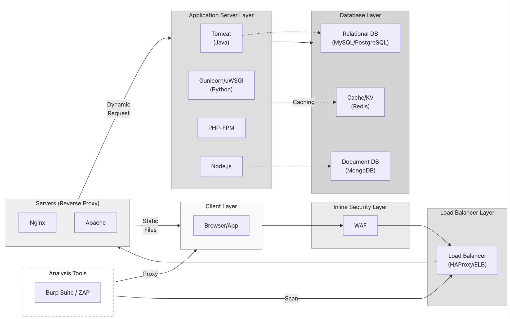

# Mapping Proxy Architecture to DB Selection

## Context

- **Tactic**: System Architecture Design & Analysis
- **Technique**: Linking Component Choices to Database Strategies
- **Procedure**: Analyze how proxy/server choices influence database selection

## Core Idea

**Figure 1.** System Architecture with Proxy and Database Layers

### 아키텍처 구성과 DB 선택의 연결 사고 흐름 

- 각 프로그램이 단일 도구로서가 아니라 **전체 스택 내에서 어떤 위치를 가지며(역할)**, 그 하위 데이터 저장 전략과 연결성(어떻게 이어지는지)을 정리한다.
- Client의 Request는 여러 프록시 계층(보안, 로드밸런서, 웹서버)을 거쳐 애플리케이션 서버에 도달하고, 최종적으로 DB와 상호작용하는 **흐름**을 이해하는 것이 중요하다.
- 이 과정에서 **일반적인 아키텍처 패턴들**과 각 구성 요소의 **특성(예: 앱 서버 언어/처리방식)이 데이터베이스 선택에 미치는 영향**을 살펴본다.
- 또한, **보안 분석 도구(Burp/ZAP)**가 이 흐름 중간에 어떻게 개입하여 테스트하는지도 고려한다.

### **1. Apache + Tomcat 조합**

이 조합은 전통적인 **Java 기반 웹 서비스 스택**에서 가장 오래된 구조 중 하나다. Apache는 주로 정적 리소스를 빠르게 처리하거나, 리버스 프록시(mod_proxy, mod_jk, mod_ajp 등)를 통해 Tomcat으로 요청을 전달한다. Tomcat은 Servlet, JSP와 같은 Java 기반 애플리케이션을 처리하는 WAS(Web Application Server)로, 전통적으로 **관계형 데이터베이스(RDBMS)**인 **MySQL**이나 **PostgreSQL**과 잘 맞는다. 비즈니스 로직이 복잡하고 트랜잭션 정합성이 중요할 경우 이 조합이 선호된다.

> 즉, Apache → Tomcat → MySQL/PostgreSQL은 전형적인 MVC(Model-View-Controller) 기반의 기업형 애플리케이션 구조로 이어진다. 이 구조는 신뢰성과 검증된 모듈성, 관리 가능한 세분화 덕분에 안정적인 서비스에 적합하다.

### **2. Nginx + Node.js / uWSGI / PHP-FPM 조합**

Nginx는 가볍고 비동기 이벤트 기반 처리 모델을 갖춘 웹 서버이며, **리버스 프록시, 정적 리소스 제공, 로드 밸런서**로 뛰어난 성능을 발휘한다. Nginx는 **Node.js**나 **uWSGI(Gunicorn 포함)** 또는 **PHP-FPM**과 같은 앱 서버들과 조합된다.

- Node.js는 단일 스레드 기반의 이벤트 루프 모델로, JSON과의 궁합이 좋은 **MongoDB**와 자주 결합된다. 데이터 구조가 유연하고 빠르게 변해야 하는 서비스(예: 채팅, 실시간 분석 등)에 적합하다.
- uWSGI는 파이썬 기반 웹 프레임워크(Django, Flask 등)의 WSGI interface와 연결되며, 복잡한 ORM 처리와 트랜잭션을 자주 다루므로 일반적으로 **PostgreSQL**을 선호한다.
- PHP-FPM은 PHP 애플리케이션의 FastCGI 처리 프로세스 매니저로, 전통적인 **MySQL** 스택(=LAMP 혹은 LEMP)과 긴밀하게 작동한다. 캐싱이 중요할 경우 **Redis**가 함께 사용되기도 한다.

> 이 구조의 핵심은 **Nginx가 경량 고속 라우터이자 리버스 프록시로 작동하면서**, 각 백엔드 앱 서버의 특성에 맞는 데이터 스토어와 연결된다는 점이다. 유연성과 확장성 중심의 현대적인 웹 서비스에서 많이 사용된다.

### 3. HAProxy 기반 구조

HAProxy는 특별히 **고가용성(HA)**과 **트래픽 분산(Load Balancing)**에 최적화된 프록시이다. 주로 TCP, HTTP 요청을 다루며, 상태 기반의 Health Check를 통해 장애 발생 시 자동으로 트래픽을 우회시킨다. 따라서 Apache나 Nginx와는 달리, **자체적으로 앱 서버를 가지지 않지만**, 기존의 Tomcat, Node.js, PHP-FPM, uWSGI를 연결하는 상위 분산 계층에서 작동한다.

> HAProxy는 “서비스 중단 없는 배포 전략(Rolling Deploy, Blue-Green Deploy)“의 핵심 구성 요소이며, 데이터베이스 레벨에서는 반드시 **마스터-슬레이브 구조** 또는 **클러스터링 가능한 스토리지(MariaDB Galera Cluster, Redis Sentinel 등)**과 함께 사용된다.

### 4. Burp Suite / OWASP ZAP

이 프록시는 개발 운영과 직접적인 연관은 없지만, 보안 테스트 환경에서 핵심적인 역할을 수행한다.

MITM(Man-in-the-middle) 프록시로 설정된 상태에서, 클라이언트-프록시-서버 구조를 구성하여, 통신 중간의 데이터를 조작, 분석할 수 있다.

- 주로 **Nginx / Apache** 앞단에 위치시켜, 요청과 응답 사이의 변조 가능성을 테스트하고
- 백엔드의 **입력 검증이 부족한 DB 질의(SQLi)**, 혹은 **세션 처리 허점**이 있는지 탐지한다.

> Burp, ZAP는 **보안 관점에서 프록시 아키텍처를 점검하는 도구**로, 실제 데이터베이스를 조작하는 것이 아니라, 그 전 단계에서 이를 유도할 수 있는 입력 경로를 분석한다. 보안과 운영이 만나는 교차지점이다.

### Summary
- **Apache + Tomcat** → RDB 기반의 정통 구조 (Traditional RDBMS-based structure)
- **Nginx + Node/uWSGI/PHP-FPM** → 비동기 확장성 중심의 현대 구조 (Modern structure focused on asynchronous scalability)
- **HAProxy** → 전체 서비스의 상단 조율자 (트래픽 분산 및 HA 전략) (Top-level coordinator for the entire service - traffic distribution & HA strategy)
- **Burp/ZAP** → 보안 테스트에서 사용되는 도구이자, 프록시 체인의 감시자 (Tool used in security testing and monitor of the proxy chain)

각 구조는 독립적이면서도, 하나의 시스템 내에서 조합될 수 있다. 특히 프록시 계층과 앱 서버 계층은 분리된 책임과 역할을 가지며, 하위 DB 선택은 **앱 서버의 언어, 처리 방식, 데이터 특성에 따라 달라지는 자연스러운 연쇄 결과**로 연결된다.

## Note
- 프록시/웹 서버, 애플리케이션 서버, 데이터베이스의 선택은 서로 밀접하게 연관되어 있다. 한 계층에서의 변경은 **다른 계층의 조정**을 필요로 하는 경우가 많다.
- 데이터베이스 선택은 애플리케이션의 **요구사항**(예: 데이터 구조 유연성, 트랜잭션 처리 필요성, 확장 방식)에 크게 **좌우**되며, 이는 애플리케이션 서버 계층에서 **사용하는 언어나 프레임워크**와 밀접한 관련이 있다.
- 보안 분석(Burp/ZAP 등의 도구 활용)은 각 계층 간 상호작용의 **보안성을 검증**하기 위해 개발 및 테스트 과정에 통합되어야 한다.
- 향후 이 관점을 확장하여 CDN(콘텐츠 전송 네트워크)과 같은 상위 구성 요소까지 포함할 수 있다.
	- “CDN → Proxy → App Server → DB”로 이어지는 전체적인 고속 요청 경로 분석 등