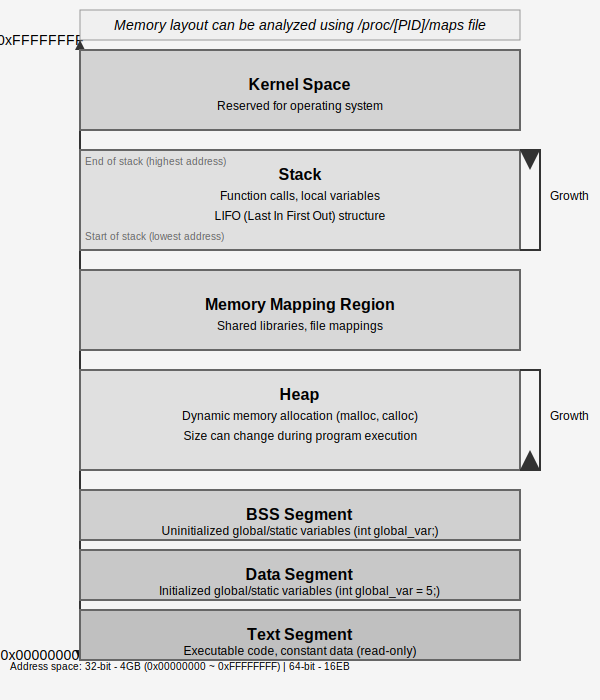
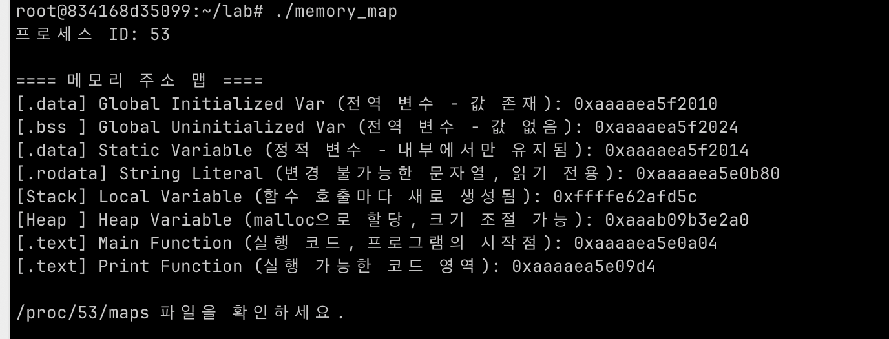

## Context
- **Tactic**: System Architecture Understanding
- **Technique**: Memory Structure Analysis
- **Procedure**
	- Analyze the process memory layout to understand the roles and limitations of each virtual address region
	- Identify regions prone to vulnerabilities (e.g., Stack, Heap, BSS)  
	- Logically map which memory segments are viable targets for exploitation or defense
	- Build foundational knowledge for analyzing stack overflows, use-after-free (UAF), and information leakage

## Core Idea

**Figure 1.** process memory structure

| Section           | Description                                                                  |
| ----------------- | ---------------------------------------------------------------------------- |
| Text/Code Segment | Executable instructions; read-only to prevent code tampering                 |
| Data Segment      | Global/static variables; `.data` (initialized), `.bss` (uninitialized)       |
| Heap              | Dynamically allocated (`malloc`, etc); grows upward, may cause fragmentation |
| Stack             | Local variables and call frames; grows downward, vulnerable to overflow      |

## Code / Experiment


**Memory Layout Visualization Program**  
The following C code prints the actual memory addresses of key segments in the process:
```c
#include <stdio.h>
#include <stdlib.h>
#include <string.h>
#include <unistd.h>

/* 전역 변수 */
int global_var = 100;
int uninit_global_var;
const char *string_literal = "Hello, World!";

/* 정적 변수 */
static int static_var = 200;

void print_address(const char *desc, const void *addr) {
    printf("%-50s: %p\n", desc, addr);
}

int main() {
    int local_var = 10;
    int *heap_var = (int *)malloc(sizeof(int));
    *heap_var = 50;

    printf("프로세스 ID: %d\n\n", getpid());
    printf("==== 메모리 주소 맵 ====\n");

    print_address("[.data] Global Initialized Var", &global_var);
    print_address("[.bss ] Global Uninitialized Var", &uninit_global_var);
    print_address("[.data] Static Variable", &static_var);
    print_address("[.rodata] String Literal", string_literal);
    print_address("[Stack] Local Variable", &local_var);
    print_address("[Heap ] Heap Variable", heap_var);
    print_address("[.text] Main Function", main);
    print_address("[.text] Print Function", print_address);

    printf("\n/proc/%d/maps 파일을 확인하세요.\n", getpid());

    printf("\n계속하려면 Enter 키를 누르세요...");
    getchar();

    free(heap_var);
    return 0;
}
```



**Figure 2.** memory-map program result

## Note

Understanding these patterns is essential for identifying memory vulnerabilities and analyzing how exploits operate in practice.

- **Memory Map**
```markdown
  0xFFFFFFFF  ────────────  [ Kernel Space ]  (Reserved for OS)
       ↑
       │  [ Stack ]  (LIFO, grows downward)
       │  - Function calls, local variables
       │
  0x7FFFxxxx  ────────────  [ Stack Base ]
       │
       │  [ Memory Mapping Region ]  
       │  - Shared libraries, mmap files
       │
  0x5555xxxx  ────────────  [ Heap ]  (malloc, grows upward)
       │  
       │  [ BSS Segment ]  (Uninitialized global/static variables)
  0x5555yyyy  ────────────  [ Data Segment ]  (Initialized global/static variables)
       │
  0x5555zzzz  ────────────  [ Text Segment ]  (Executable code, read-only)
  0x00000000  ────────────  [ NULL Pointer ]
```

*⚠ This note uses the terms **Memory Region** and **Memory Layout** interchangeably to provide a unified view of the process’s virtual address space—its roles and structure.
A follow-up note will analyze `/proc/[pid]/maps` to explore each segment’s **access permissions (rwx)** and **mapping characteristics** in more detail.*

Memory Region은 실행 중인 프로세스에서 서로 다른 역할을 수행하며, 특정 규칙에 따라 접근 및 변경이 가능하다.

Stack은 함수 호출마다 **새로운 스택 프레임(Stack Frame)이 추가**되며, 스택 프레임에는 `함수의 매개변수, 지역 변수, 리턴 주소 등`이 저장된다. 함수가 실행을 마치면 해당 스택 프레임이 제거, 호출한 함수로 복귀한다. 이러한 구조 덕분에 함수 호출이 재귀적으로 동작할 수 있다. 하지만 스택이 계속 증가하여 한계에 도달하면 **스택 오버플로우(Stack Overflow)**가 발생한다.

Heap은 동적 메모리 할당(`malloc`, `calloc`)을 통해 생성되며, 명시적으로 해제(`free`)하지 않으면 **메모리 누수(Memory Leak)**가 발생할 수 있다. Heap은 Stack과 달리 프로그램 실행 중 크기가 동적으로 조절되며, 명확한 할당/해제 규칙이 없을 경우 **메모리 파편화(Fragmentation)** 문제가 발생할 수도 있다.

Data Section은 프로그램 실행 중에도 유지되는 변수를 저장하는 영역이며, **실행 파일 내에서 초기 값이 존재하는지 여부**에 따라 두 개의 서브 섹션으로 나뉜다.

- **`.data` (초기화된 데이터 영역)**: 초기값이 있는 전역 변수와 정적 변수가 저장되며, 프로그램 실행 전 파일(.exe, ELF 등) 내부에 초기값이 포함되어 있음.
    - 예: `int global_var = 42;` → 실행 파일에 `42`라는 값이 이미 포함되어 로드됨.
- **`.bss` (초기화되지 않은 데이터 영역)**: 초기화되지 않은 전역 변수와 정적 변수가 저장되며, 실행 시 자동으로 `0`으로 초기화됨.
    - 예: `int uninit_global;` → 실행 파일에 값이 포함되지 않으며, 실행 중에 `0`으로 설정됨.

또한, Data Section의 변수들은 **프로그램이 종료될 때까지 유지되며**, Stack과 다르게 함수 호출과 무관하게 접근할 수 있다. 즉, **같은 값을 여러 함수에서 공유해야 할 때 사용**되며, 메모리 누수와는 무관하지만 ****데이터 오염 문제(Unexpected Global State)를 유발할 가능성이 있다.

Text 영역은 실행 가능한 코드가 저장되는 곳으로, 일반적으로 읽기 전용(Read-Only)으로 설정되어 있다. 이는 코드가 무단으로 수정되는 것을 방지하여 프로그램의 보안성을 높인다.
